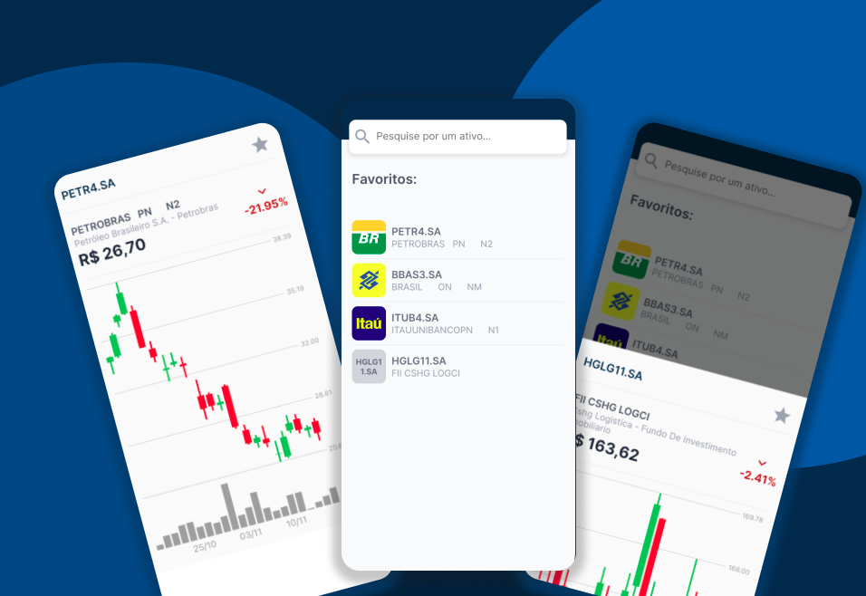

## Stock Prices - Teste técnico para a vaga de desenvolvedor Flutter sênior

Essa é uma aplicação fícticia, desenvolvida com o intuito de demonstrar meus conhecimentos sobre engenharia de software afim de concorrer a uma vaga de desenvolvedor Flutter sênior.


### Desafio:

O desafio solicitado pela empresa foi a criação de um App onde o usuário possa visualizar o gráfico de variação de preço e a valorização/desvalorização do ativo nos últimos 30 dias 


### Dependências:
- `dio` - Responsável pelo envio de requisições HTTP;
- `intl` - Responsável pela internacionalização da aplicação (formatação de datas, moedas, etc.);
- `http_query_string` - Responsável por auxiliar a criação de Query Strings para requisições HTTP;
- `interactive_chart` - Exibição de indicadores Candlestick;
- `bottom_sheet` - Exibição da modal inferior.


### Arquitetura:

Essa API foi desenvolvida seguindos princípios modernos de engenharia de software com o objetivo de garantir o máximo desacoplamento entre as camadas e aumentar a coesão das classes e objetos.

Toda a arquitetura dessa aplicação foi baseada no padrão "Clean Architecture", seguindo diversos princípios de SOLID e Clean Code (SRP, OCP, DIP, DRY, YAGNI, KISS, etc.)

Também foram aplicados alguns Design Patterns como: Factory, Adapter, Builder, Strategy, Dependency Injection, etc.

Na parte de gerenciamento de estado foi utilizado o padrão BloC, juntamente com a estratégia de Cubit.


### Execução em ambiente local:

Para executar a aplicação basta clonar esse repositório e executar os seguintes instruções na sua linha de comando:

```bash
flutter pub get
flutter run
```

**Obs.: eu testei essa aplicação somente no iOS através do Simulator, portanto não posso garantir 100% de certeza no funcionamento no sistema Android.**

### Operação:

